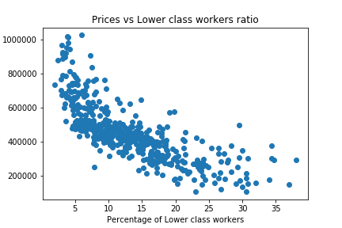

# Project: Predicting Boston Housing Prices

# Table of Contents
- [Project Description](#project-description)
- [Environment and Programming language](#environment-and-programming-language)
- [Data Description](#data-description)
- [Exploratory Data Analysis](#exploratory-data-analysis)
  * [Reading the Data](#reading-the-data)
  * [Statistics Calculations](#statistics-calculations)
  * [Feature Observations](#feature-observations)
- [Developing a model](#developing-a-model)
  * [Define a performance metric](#define-a-performance-metric)
  * [Goodness of fit](#goodness-of-fit)
  * [Shuffle and Split Data](#shuffle-and-split-data)
  * [Training and Testing](#training-and-testing)
- [Analyzing Model Performance](#analyzing-model-performance)
  * [Learning Curves](#learning-curves)
  * [Complexity Curves](#complexity-curves)
  * [Bias-Variance Trade-off](#bias-variance-trade-off)
  * [Best-Guess Optimal Model](#best-guess-optimal-model)
- [Evaluating Model Performance](#evaluating-model-performance)
  * [Cross-Validation](#cross-validation)
- [Fitting a Model](#fitting-a-model)
- [Making Predictions](#making-predictions)
  * [Optimal Model](#optimal-model)
  * [Predicting Selling Price](#predicting-selling-price)
- [Sensitivity](#sensitivity)
- [Applicability](#applicability)

## Project Description
This project includes exploring Boston housing price data, build a predictive model, evaluate and validate the model.

A model trained on this data that is seen as a _good fit_ could then be used to make certain predictions about a home — in particular, its monetary value. This model would prove to be invaluable for someone like a real estate agent who could make use of such information on a daily basis.

## Environment and Programming language
* Python 2.7.14 has been used.
* Miniconda framework has been used which can be downloaded from this [link](https://repo.continuum.io/miniconda/).
* Once installed, open conda prompt.
* Create virtual environment by using `conda env create -f environment.yaml`. [**environment.yaml**](./environment.yaml) has been included in the repository.
* Jupyter notebook has been used for interactively analyzing and exploring the data.
* Python code and calculation given in the [Notebook file](./boston_housing.ipynb) file.
* We are going to use [helper file](./visuals.py). This file contains following 3 functions:
  1. `ModelLearning(X, y)`: Calculates the performance of several models with varying sizes of training data. The learning and testing scores for each model are then plotted.
  2. `ModelComplexity(X, y)`: Calculates the performance of the model as model complexity increases. The learning and testing errors rates are then plotted.
  3. `PredictTrials(X, y, fitter, data)`: Performs trials of fitting and predicting data.

## Data Description
[Data](./housing.csv) has been provided as a csv file. The dataset for this project originates from the [UCI Machine Learning Repository](https://archive.ics.uci.edu/ml/datasets/Housing). The Boston housing data was collected in 1978 and each of the 506 entries represent aggregated data about 14 features for homes from various suburbs in Boston, Massachusetts. For the purposes of this project, the following pre-processing steps have been made to the dataset:

* 16 data points have an `'MEDV'` value of 50.0. These data points likely contain **missing or censored values** and have been removed.
* 1 data point has an `'RM'` value of 8.78. This data point can be considered an **outlier** and has been removed.
* The features `'RM'`, `'LSTAT'`, `'PTRATIO'`, and `'MEDV'` are essential. The remaining **non-relevant features** have been excluded.
* The feature `'MEDV'` has been **multiplicatively scaled** to account for 35 years of market inflation.

Following is the detail of the columns in the dataset.

**Features**
1.  `RM`: average number of rooms per dwelling.
2. `LSTAT`: percentage of population considered lower status.
3. `PTRATIO`: pupil-teacher ratio by town.

**Target Variable**
4. `MEDV`: median value of owner-occupied homes.

## Exploratory Data Analysis

### Reading the Data
1. First step to read the data. **pandas read_csv()** function is used to read the data.
2. Save the **MEDV** which is **target variable** and will be predicted by the model to a new variable called **prices** and all other variables were used to predict the target variables and were saved to new variable called **features**.
3. Dataset size was found and it was found that **Boston housing dataset has 489 data points with 4 variables each.**

Following code has been used for above mentioned steps.
```
# Load the Boston housing dataset
data = pd.read_csv('housing.csv')
prices = data['MEDV']
features = data.drop('MEDV', axis = 1)

# Success
print "Boston housing dataset has {} data points with {} variables each.".format(*data.shape)
```

### Statistics Calculations
Some statistics like mean, median, max, min and standard deviation were calculated on the target variable **MEDV** using numpy library functions.

Following code has been used:
```
minimum_price = prices.min()
maximum_price = prices.max()
mean_price = prices.mean()
median_price = prices.median()
std_price = prices.std()
```
Following are the calculated statistics:

* Minimum price: $105,000.00
* Maximum price: $1,024,800.00
* Mean price: $454,342.94
* Median price $438,900.00
* Standard deviation of prices: $165,340.28

### Feature Observations
In this section we will have the intuition of the effect of features on target variable.
* RM value(Number of rooms) will increase the price of the home as usually number of rooms increase the area of the house and which usually increase the price also. People wants to pay more price for larger area with more number of rooms instead of smaller area with less number of rooms in the house.
* LSTAT value is the percentage of lower class workers. So usualy higher the percentage of this lower should be the price of the house. Reason is higher the lower class workers then that locality will not be that much expensive otherwise higher numbers of lower class workers will not be there. So clearly whether locality is expensive or not is one of the factor which decides percentage of lower class workers. So usually increase in the LSTAT percentage will decrease the house price.
* PTRATIO value is ratio of students to teachers. So more teachers per student or less is the ratio between students and teachers denotes better schools. Better schools automatically makes that locality better and which will cause higher house prices.

**We can visualize all of the above intuitions in the graphs. So lets plot scatterplot for prices vs above mentioned three features. Also we can see the same thing with correlation coefficient.**





Following code has been used to calculate the correlation coefficients.
```
corr_RM_price = np.corrcoef(features['RM'], prices)
corr_LSTAT_price = np.corrcoef(features['LSTAT'], prices)
corr_PTRATIO_price = np.corrcoef(features['PTRATIO'], prices)
```
Following are the correlation coefficients between features and target variables.
* correlation coefficient between number of rooms and prices is 0.697209221019.
* correlation coefficient between percentage of lower income workers and prices is -0.760670059973.
* correlation coefficient between ratio between students and teachers and prices is -0.519033503532.

**Correlation coeeficient value can be between -1 and +1. 0 denotes no correlation between 2 variables, positive values denotes increment in one variable causes increment in other variable and negative values denotes increment in one variable causes decrement in other variable. Values nearer to -1 or +1 denotes stronger correlation.**

* We can clearly see that there is strong positive correlation between number of rooms and prices.

* We can clearly see that there is strong negative correlation between percetange of lower income workers and prices.

* We can clearly see that there is a negative correlation between ratio between students and teachers and prices.

**So intuition is justified with correlation coefficients and scatter plots also.**

## Developing a model
We will develop the tools and techniques necessary for a model to make a prediction. Being able to make accurate evaluations of each model's performance through the use of these tools and techniques helps to greatly reinforce the confidence in your predictions.

### Define a performance metric
It is difficult to measure the quality of a given model without quantifying its performance over training and testing. This is typically done using some type of performance metric, whether it is through calculating some type of error, the goodness of fit, or some other useful measurement. For this project, you will be calculating the [*coefficient of determination*](http://stattrek.com/statistics/dictionary.aspx?definition=coefficient_of_determination), R<sup>2</sup>, to quantify your model's performance. The coefficient of determination for a model is a useful statistic in regression analysis, as it often describes how "good" that model is at making predictions.

The values for R<sup>2</sup> range from 0 to 1, which captures the percentage of squared correlation between the predicted and actual values of the **target variable**. A model with an R<sup>2</sup> of 0 is no better than a model that always predicts the *mean* of the target variable, whereas a model with an R<sup>2</sup> of 1 perfectly predicts the target variable. Any value between 0 and 1 indicates what percentage of the target variable, using this model, can be explained by the **features**. _A model can be given a negative R<sup>2</sup> as well, which indicates that the model is **arbitrarily worse** than one that always predicts the mean of the target variable._

Function `performance_metric(y_true, y_predict)` has been used for this. This function calculates and returns the performance score between true and predicted values based on the metric chosen.

### Goodness of fit
Performance metric function has been used on some hypothetical true and predicted values. Following code has been used:
```
score = performance_metric([3, -0.5, 2, 7, 4.2], [2.5, 0.0, 2.1, 7.8, 5.3])
```
Model has a coefficient of determination, R<sup>2</sup>, of 0.923.

R2 score denotes the proportion of the variance in the dependent variable that is predictable from the independent variable. So higher this value, better is the fit. So in our case we have R<sup>2</sup> score of 0.923 so 92.3% of variance has been explained by the fit so which is very good score because having 100% variance explained or R<sup>2</sup> score of 1 is very rare. So 0.923 is very good R2 score.

### Shuffle and Split Data
split the data into training and testing subsets. Typically, the data is also shuffled into a random order when creating the training and testing subsets to remove any bias in the ordering of the dataset. This is required so that model can be fit on training data and can be tested on other partition of the data which is not used in model fitting process.

This gives us idea how well model is generalizing over the data. `train_test_split` from `sklearn.cross_validation` to shuffle and split the `features` and `prices` data into training and testing sets. It also split the data randomly. 20% of the data has been put into test set.

Following has been used.
```
X_train, X_test, y_train, y_test = train_test_split(features, prices, test_size = 0.2, random_state = 0)
```

### Training and Testing
We need to have one test set to measure performance of the model on data points which model has never ever seen. There are following reasons for the same.
We have 2 kinds of issues while fitting a model :
1. **Underfitting (High Biased model)** : This model explains very low variance in the dependent variable. This model usually have bad performance on training as well as testing sets.
2. **Overfitting (High variance model)** : This model have very high variance which means it fits almost perfectly on the train set but doesnt generalizes well on the data. Its like memorizing the thing instead of understanding. So this model have high performance on train set but have very different and usually very low performance on test set as compared to train set.

So we need to split data into train and test set to find out whether model is overfitting or underfitting or it is just good fit on the data so that it can be used for prediction on unknown data points.

## Analyzing Model Performance
We will take a look at several model's learning and testing performances on various subsets of training data.Additionally, We will investigate one particular algorithm with an increasing `'max_depth'` parameter on the full training set to observe how model complexity affects performance. Graphing your model's performance based on varying criteria can be beneficial in the analysis process, such as visualizing behavior that may not have been apparent from the results alone.

### Learning Curves
The following code cell produces four graphs for a decision tree model with different maximum depths. Each graph visualizes the learning curves of the model for both training and testing as the size of the training set is increased. Note that the shaded region of a learning curve denotes the uncertainty of that curve (measured as the standard deviation). The model is scored on both the training and testing sets using R<sup>2</sup>, the coefficient of determination.

We used function `vs.ModelLearning(features, prices)` from visuals.py helper file.

We got following graphs:


* We can see training and testing scores are getting converged only for max_depth = 1 and max_depth = 3 but not converging for max_depth = 6 and max_depth = 10.

* For max_depth = 1, training and testing scores are getting converged at low score value which is around 0.4. We can clearly see training and testing scores are closest at around 300 data points after that gap between both the scores is increasing. So increasing more data points is not giving any benefit.

* For max_depth = 3, training and testing scores are getting converged at acceptable score value which is around 0.8. We can clearly see training and testing scores are closest at around 300 data points after that gap between both the scores is increasing. So increasing more data points is not giving any benefit.

* For max_depth = 6, training and testing scores are not getting converged because gap between training and testing score is large. But, we can clearly see training and testing scores are closest at around 300 to 350 data points after that gap between both the scores is increasing. So increasing more data points is not giving any benefit.

* For max_depth = 10, training and testing scores are not getting converged because gap between training and testing score is very large. But, we can clearly see training and testing scores are closest at around 300 to 350 data points after that gap between both the scores is increasing. So increasing more data points is not giving any benefit.

**So we can clearly see putting more data points beyond 300 is not giving any benefit in score. So we can use only 300 points to the model and use the model because of no further improvement in the model beyond 300 data points.**

### Complexity Curves
The following code cell produces a graph for a decision tree model that has been trained and validated on the training data using different maximum depths. The graph produces two complexity curves — one for training and one for validation. Similar to the **learning curves**, the shaded regions of both the complexity curves denote the uncertainty in those curves, and the model is scored on both the training and validation sets using the `performance_metric` function and `vs.ModelComplexity(X_train, y_train)` function from is used to plot the complexity curve.

Following graph is given for the same:


### Bias-Variance Trade-off
* When model is trained with maximum depth of 1 then it is underfitting the model because I can clearly see that both training and testing scores are close to each other but these scores are very low. So this is clearly high bias model.
* With maximum depth of 10 then it is overfitting because I can clearly see that training score has been reached to a perfect score of 1 but testing score has decreased as compared to maximum depth of 4. So model is not converging at maximum depth of 10 which shows model is performing very well at training set but not performing equally well on testing set. This clearly a high variance model.

### Best-Guess Optimal Model
* To have a generalized model, we should have similar reasonably good training and testing scores and gap between both the scores should be minimum.

* From the graph, we can clearly see that minimum gap between training and testing set is at maximum depth = 3. So both scores converged at maximum depth = 3. After maximum depth = 3 both scores started moving away from each other, that is, training score started increasing and testing score started decreasing slightly. Before maximum depth = 3, gap between training and testing score is less than as compared to the same at maximum depth = 3 but scores at these levels are very low.

**So maximum depth = 3 at which model generalized very well.**

## Evaluating Model Performance
* There are 2 kind of parameters in a model:
  1. Paremeters which are learnt automatically by the model from the dataset.
  2. Parameters which are not learnt automatically by the model and instead requires manual setting. These are called hyperparameters.
* One example of such parameter is max_depth which is required to be set manually during creating a regressor in regression tree.
* Grid search allow to use different values of hyperparameters and find the optimal values of those paramters as per metric used to measure model fit goodness.
* Grid search allow us to tune the hyperparameters of a model and gives us the optimal value of that parameter.

### Cross-Validation
* Cross-Validation is the process of fitting model on some set of data points called training set and testing the model fit on other set of data points called testing set.
* Cross-Validation using train and test model split have disadvantage that model doesn't use whole data set for learning because some part of dataset will be kept aside for testing purposes.
* k-fold cross-validation is a technique in which whole dataset will be sliced in k parts where k is an integer value. Model will be fit on k-1 slices and will be tested on kth slice. Same procedure will be repeated k times and everytime model will be tested on the slice on which it hasn't been tested yet after fitting all other slices. In the end, average of all the K fits will be used as the final model.
* Grid search on train-test set arrangement only give hyperparameter optimal value on the basis of train test and data points in train test can be very different than data points in the test set. So grid search in train-test set arrangement doesn't necessary give optimal value as per whole data set.
* Grid search on k-fold cross-validation, use whole data set and average out the values for all k fits. So k-fold cross-validation gives more optimal value and fit model in a better way as compared to train-test set arrangement.

## Fitting a Model
We will use user defined fucntion `fit_model(X, y)` to fit the model. This function Performs grid search over the 'max_depth' parameter for a decision tree regressor trained on the input data [X, y].

Following steps involved in fitting the model.
1. Create cross-validation set. `ShuffleSplit()` from sklearn library is used for this and we generated 10 CV sets with 20% data reserved for test set.
2. Create a decision tree regressor using `DecisionTreeRegressor()` function.
3. We saved a **max_depth** values which we want to try in a dictionary.
4. We created one scoring function using `make_scorer` function of the sklearn and used user defined function `performance_metric` in `make_scorer` function.
5. We used `GridSearchCV()` function from sklearn for grid search cross validation procedure.
6. Then we fit grid search CV on the data.
7. Finally we take out the best estimator parameter from the grid search.

These all steps is done by function `fit_model(X, y)`. This function Performs grid search over the 'max_depth' parameter for a decision tree regressor trained on the input data [X, y] and returns the best estimator.

## Making Predictions
Once a model has been trained on a given set of data, it can now be used to make predictions on new sets of input data. In the case of a *decision tree regressor*, the model has learned *what the best questions to ask about the input data are*, and can respond with a prediction for the **target variable**. We can use these predictions to gain information about data where the value of the target variable is unknown — such as data the model was not trained on.

### Optimal Model
Optimal max_depth for the model is 4.

### Predicting Selling Price
We took some hypothetical data and calculated the target variable on the hypothetical data using our model.

## Sensitivity
An optimal model is not necessarily a robust model. Sometimes, a model is either too complex or too simple to sufficiently generalize to new data. Sometimes, a model could use a learning algorithm that is not appropriate for the structure of the data given. Other times, the data itself could be too noisy or contain too few samples to allow a model to adequately capture the target variable — i.e., the model is underfitted.

**We run the `fit_model` function ten times with different training and testing sets to see how the prediction for a specific client changes with respect to the data it's trained on.**

We used `vs.PredictTrials(features, prices, fit_model, client_data)` function from the visuals.py file.

Following are the results of the same:

Trial 1: $391,183.33

Trial 2: $419,700.00

Trial 3: $415,800.00

Trial 4: $420,622.22

Trial 5: $418,377.27

Trial 6: $411,931.58

Trial 7: $399,663.16

Trial 8: $407,232.00

Trial 9: $351,577.61

Trial 10: $413,700.00

Range in prices: $69,044.61

## Applicability
* Data collected in 1978 is not relevant anymore because inflation is a big factor along with change in neighborhood, urbanisation, etc are the some of the factors which must have changed the prices drastically.
* Features present in the data are not sufficient to describe a home. Factors like quality of appliances in the home, square feet of the plot area, presence of various other amenities like pool, garden, etc should also be factored in.
* Model is not robust enough to make the consistent predcitions because we can see a wide range of predictions which is almost \$69,044.61.
Data collected in the urban city is not applicable in rural city because features which are used to predict in the urban area are usually different in rural areas.
* it is fair to judge the price of an individual home based on characteristics of the entire neighbourhood because various characteristics of the neighbourhood plays very important role in determining the prices of a house along with own characteristics of the house.
